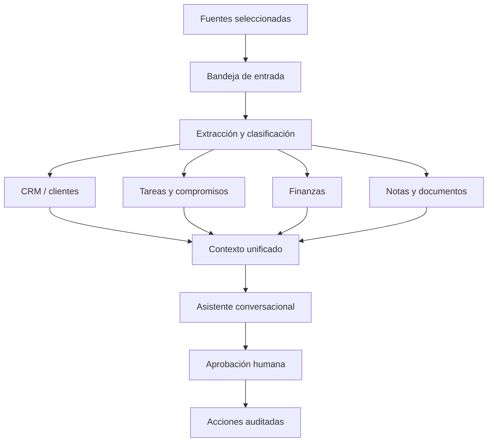

# Hoja de ruta — asistente integral

## Objetivo

Convertir el proyecto en un asistente operativo personal y comercial que centralice:

- conversaciones elegidas por el usuario;
- clientes y oportunidades;
- tareas, recordatorios y compromisos;
- ingresos, gastos, cuentas, presupuestos y vencimientos;
- documentos y notas;
- resúmenes diarios y alertas;
- acciones seguras, siempre auditadas y confirmables.

La idea no es que “la IA haga de todo” sobre texto suelto. Cada módulo debe tener datos estructurados, reglas claras y una capa conversacional por encima.

## Principio de privacidad

El modo base es **opt-in**:

1. WhatsApp permite descubrir que un chat existe.
2. Se conserva solo metadata mínima para mostrarlo en el selector.
3. El contenido se ignora hasta activar `Leer este chat`.
4. Desactivar lectura frena mensajes futuros, pero no borra el historial ya guardado.
5. Borrar historial debe ser una acción distinta, explícita y confirmada.
6. El chat privado de control funciona siempre.

## Modelo propuesto



## Módulos

### 1. Selección de fuentes — implementado

- Selector de lectura en `/chats`.
- Lectura desactivada por defecto.
- Metadata mínima de chats no seleccionados.
- Contenido, audio e IA solo para chats seleccionados.
- Política fail-closed si no se puede consultar el permiso.

Siguiente mejora: selección masiva, filtros “leyendo/ignorados” y opción para borrar el historial al desactivar.

### 2. CRM de clientes — parcialmente implementado

Ya existen contactos, perfiles, prioridad, intereses, vehículos, objeciones, promesas, tareas y detección de clientes calientes.

Falta:

- etapas de oportunidad configurables;
- valor estimado y probabilidad;
- responsable;
- próxima acción y fecha;
- etiquetas y segmentos editables;
- historial comercial;
- pipeline visual;
- combinación segura de contactos duplicados;
- importación/exportación CSV.

### 3. Tareas y agenda — primera versión funcional

Ya existe detección automática, creación manual desde el chat privado, vencimientos, recordatorios por WhatsApp, consulta `/agenda` y dashboard diario en `/calendar`.

Falta:

- edición manual desde el dashboard;
- asignación a proyecto, cliente o transacción;
- recurrencia;
- recordatorios;
- prioridades y vencimientos editables;
- vista “hoy / atrasadas / próximas”;
- confirmación antes de crear una tarea detectada con baja confianza;
- integración opcional con calendario.

### 4. Finanzas — nuevo módulo

Entidades mínimas:

- cuentas: caja, banco, billetera y tarjeta;
- categorías;
- transacciones de ingreso, gasto y transferencia;
- contrapartes/clientes/proveedores;
- cuotas y pagos parciales;
- facturas y comprobantes;
- presupuestos mensuales;
- vencimientos;
- moneda y tipo de cambio usado;
- conciliación y adjuntos.

Reglas indispensables:

- usar enteros en la unidad mínima (`centavos`), nunca `float`;
- toda modificación guarda auditoría;
- una detección desde chat crea un borrador, no un movimiento definitivo;
- confirmar monto, moneda, cuenta, categoría y fecha;
- separar finanzas personales y del negocio mediante espacios;
- no borrar movimientos: anularlos con motivo;
- reportes por criterio de caja al inicio; contabilidad formal requiere definición aparte.

Consultas objetivo:

- “¿Cuánto gasté este mes?”
- “Mostrame cuentas por cobrar.”
- “Registrá $35.000 de combustible desde Mercado Pago.”
- “¿Qué vencimientos tengo esta semana?”
- “¿Cuánto vendí por cliente?”
- “Compará ingresos y gastos con el mes pasado.”

### 5. Documentos y conocimiento

- adjuntar facturas, presupuestos, contratos y notas;
- OCR y extracción con revisión;
- vincular documentos con cliente, tarea o transacción;
- búsqueda semántica con permisos por espacio;
- política de retención y borrado.

### 6. Asistente conversacional

Debe entender intenciones estructuradas y llamar herramientas internas, no escribir SQL ni ejecutar acciones libremente.

Tipos de intención:

- consultar;
- crear borrador;
- modificar;
- confirmar;
- cancelar;
- resumir;
- enviar mensaje;
- programar recordatorio.

Toda acción sensible usa este ciclo:

```text
pedido → interpretación → vista previa → confirmación → ejecución → auditoría
```

Acciones sensibles: mensajes, movimientos financieros, borrados, cambios masivos, exportaciones y modificaciones de permisos.

### 7. Panel principal

Vista recomendada:

- saldo y flujo del mes;
- ingresos/gastos recientes;
- cuentas por cobrar/pagar;
- tareas de hoy y atrasadas;
- clientes calientes y oportunidades sin seguimiento;
- mensajes pendientes;
- alertas y errores de procesamiento;
- caja de comandos para hablar con el asistente.

## Orden de construcción

### Fase 1 — control y privacidad

- selección de chats;
- completar confirmación de acciones;
- reforzar autenticación;
- actualizar Next.js a una versión corregida;
- tests de integración para permisos e ingesta.

### Fase 2 — tareas y CRM utilizables

- CRUD completo de tareas;
- pipeline comercial;
- próxima acción por cliente;
- recordatorios;
- dashboard diario.

### Fase 3 — finanzas

- definir espacios, moneda y criterio;
- migraciones de cuentas/categorías/transacciones;
- CRUD y reportes;
- borradores detectados desde chats;
- confirmación y auditoría;
- importación CSV.

### Fase 4 — documentos y automatizaciones

- comprobantes/OCR;
- reglas periódicas;
- reportes semanales/mensuales;
- integraciones con calendario, email o bancos según necesidad.

### Fase 5 — asistente unificado

- router de intenciones;
- herramientas por módulo;
- permisos;
- memoria resumida;
- evaluación de respuestas;
- observabilidad y backups.

## Decisiones necesarias antes del módulo financiero

Estas definiciones cambian el esquema y no conviene adivinarlas:

1. ¿Finanzas personales, de negocio o ambas?
2. ¿Una sola moneda o ARS + USD?
3. ¿Qué cuentas se usan: efectivo, bancos, Mercado Pago, tarjetas?
4. ¿Se necesita cuentas por cobrar/pagar y cuotas?
5. ¿Los movimientos se cargarán manualmente, desde chats, CSV o todos?
6. ¿Se requiere facturación impositiva o solo control de caja?
7. ¿Habrá un solo usuario o varios colaboradores con permisos?

## Criterio de “completo”

Un módulo se considera completo cuando tiene:

- esquema y migración;
- validación de dominio;
- repositorio y servicios;
- UI de consulta y edición;
- comandos conversacionales;
- confirmaciones;
- auditoría;
- permisos;
- tests unitarios e integración;
- exportación/backup;
- documentación operativa.
