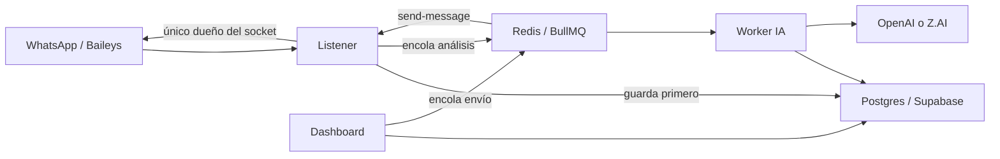

# Notas del proyecto — WhatsApp Memory Assistant

> Última revisión: 3 de julio de 2026.  
> Esta guía describe el estado observado del código, no solo la intención del README.

## Resumen en 30 segundos

Es un asistente privado conectado a una cuenta de WhatsApp mediante Baileys. Guarda mensajes y contactos en Postgres/Supabase, usa Redis + BullMQ para procesarlos en segundo plano y ofrece un dashboard privado en Next.js.

Su regla principal es: **escuchar y analizar no significa responder**. Un mensaje saliente solo puede pasar por `MessageSender`, que comprueba los interruptores de seguridad, resuelve el destinatario, registra el intento en `wa_actions` y recién entonces usa el socket de WhatsApp.

Desde la migración `0003_selective_chat_reading.sql`, la lectura también es opt-in: un chat se descubre por metadata, pero su contenido solo se guarda y analiza después de habilitarlo en `/chats`.

El listener consume los mapeos LID→teléfono de Baileys y sincroniza metadata de grupos al conectar. El dashboard prioriza nombre, teléfono y finalmente una etiqueta comprensible; no muestra un JID crudo como nombre principal.

El proyecto es un monorepo `pnpm` con Node 20+, TypeScript, tres aplicaciones y cuatro paquetes internos:

- `apps/listener`: mantiene la sesión de WhatsApp, ingiere mensajes, procesa comandos y ejecuta envíos.
- `apps/worker`: clasificación, detección de tareas, resúmenes, perfiles, embeddings y transcripción.
- `apps/dashboard`: panel privado Next.js 14.
- `packages/shared`: configuración, tipos, constantes y logging seguro.
- `packages/db`: acceso a Postgres, Storage, repositorios, consultas y migraciones.
- `packages/ai`: OpenAI/Z.AI y heurísticas locales.
- `packages/whatsapp`: normalización, audio, contexto, resolución de contactos y envío seguro.

## Arquitectura y flujo



Flujo de un mensaje entrante:

1. Baileys emite `messages.upsert`.
2. El listener normaliza el mensaje e ignora `status@broadcast`.
3. Si la escucha está pausada, lo descarta salvo que sea un comando del chat de control.
4. Actualiza metadata mínima del chat/contacto para mostrarlo en el selector.
5. Si el chat no tiene `read_enabled=true`, ignora el contenido sin persistirlo ni enviarlo a IA.
6. Guarda los mensajes permitidos antes de cualquier análisis.
7. Los duplicados no vuelven a procesarse.
8. Si es audio y la descarga está habilitada, lo sube a Supabase Storage y encola la transcripción.
9. Si tiene texto, encola `process-message`.
10. El worker clasifica, detecta tareas y luego encola embedding y resumen/perfil.

Flujo de un envío:

1. Nace en el chat de control o en el dashboard.
2. El dashboard solo encola; nunca habla directamente con WhatsApp.
3. El listener consume `send-message` porque es dueño del socket.
4. `MessageSender` resuelve el contacto o grupo.
5. `validateSend()` comprueba el switch maestro, la pausa, el texto, la ambigüedad, la confianza y el tipo de destino.
6. El intento permitido o bloqueado se registra en `wa_actions`.
7. Solo un intento validado llega a `socket.sendMessage()`.

## Estructura útil

```text
apps/
  listener/src/
    index.ts       arranque, health/QR y consumidor de envíos
    baileys.ts     conexión, reconexión y estado del socket
    handlers.ts    eventos, persistencia y encolado
    control.ts     ejecución de comandos privados
    queue.ts       cliente/worker BullMQ
  worker/src/
    index.ts       workers y health server
    processors.ts  pipeline de IA y audio
    queue.ts       infraestructura BullMQ
  dashboard/
    middleware.ts  protección de páginas y API
    src/app/       páginas App Router y endpoints
    src/lib/       auth, consultas seguras y cola de envío
packages/
  shared/src/      env, constantes, tipos y logger
  db/src/          pool, migración, Storage, repositorios y queries
  ai/src/          proveedor LLM, heurísticas, NLP y transcripción
  whatsapp/src/    extracción, contexto, audio, resolver y sender
supabase/migrations/
docker/
docs/
```

Los archivos `dist/`, `.next/` y `*.tsbuildinfo` son generados. Están ignorados por `.gitignore`, aunque actualmente existen en el disco.

## Servicios y puertos

| Servicio | Puerto por defecto | Salud / estado |
|---|---:|---|
| Dashboard | `3003` | interfaz web |
| Listener | `3001` | `/health`, `/status`, `/qr` |
| Worker | `3002` | `/health` |

`/qr` muestra el QR actual y se refresca automáticamente hasta que WhatsApp queda vinculado. La sesión se guarda en `WA_AUTH_DIR`; en Railway debe apuntar a un volumen persistente, normalmente `/app/auth`.

Solo debe correr **una instancia del listener por número**. Worker y dashboard sí pueden separarse como servicios.

## Colas

Las colas están centralizadas en `packages/shared/src/constants.ts`.

| Cola | Productor principal | Consumidor | Función |
|---|---|---|---|
| `process-message` | listener / transcripción | worker | clasificación + tareas y fan-out |
| `generate-embedding` | worker | worker | embedding de 1536 dimensiones |
| `summarize-chat` | worker | worker | resumen y perfil del contacto |
| `transcribe-audio` | listener | worker | descarga desde Storage, transcripción y reproceso |
| `send-message` | dashboard | listener | envío validado por el dueño del socket |
| `classify-message` | uso manual | worker | actualmente llama al pipeline completo |
| `detect-task` | uso manual | worker | actualmente llama al pipeline completo |
| `download-audio` | sin productor/consumidor observado | — | reservada, actualmente sin uso |

Los jobs usan 3 intentos con backoff exponencial. El worker general corre con concurrencia 4 y el consumidor del listener con concurrencia 2.

## IA y funcionamiento sin proveedor

`AIProcessor` puede trabajar con:

- OpenAI para chat, embeddings y transcripción.
- Z.AI/OpenAI-compatible como proveedor preferido de chat si se configura.
- Heurísticas locales en español cuando no hay proveedor de chat.
- Pseudo-embeddings deterministas cuando no hay proveedor de embeddings.

Las heurísticas clasifican mensajes, detectan señales comerciales y promesas/tareas. Las clases posibles incluyen `cliente_caliente`, consultas de precio/financiación/permuta/entrega, documentación, venta cerrada, reclamo, grupo interno y ruido.

Z.AI solo reemplaza el chat. Embeddings y transcripción siguen dependiendo de OpenAI.

## Comandos de control

Se aceptan únicamente si el mensaje:

- tiene `fromMe=true`; y
- llega al chat propio configurado, al JID del dueño o a su LID.

Comandos implementados:

- `/status`
- `/resumen hoy`
- `/clientes calientes`
- `/pendientes`
- `/agenda` y `/hoy`
- `/sin-responder`
- `/buscar <texto>`
- `/buscar-audios <texto>`
- `/chat <nombre o teléfono>`
- `/mandar <contacto>: <mensaje>`
- `/mandar-grupo <grupo>: <mensaje>`
- `/pausar` y `/reanudar`
- `/pausar-envios` y `/reanudar-envios`

También hay parser heurístico para frases como “mandale a Juan que mañana le paso las fotos”. Cada comando reconocido queda auditado en `wa_command_logs`.

El chat privado también acepta tareas naturales, por ejemplo: `Pendiente subir historias Ventas Jesús`, `Tarea llamar a Juan mañana a las 10` o `Recordame pagar seguro el 8/7 a las 9`. Las tareas aparecen en `/calendar`; si incluyen recordatorio, el listener avisa únicamente por el chat privado de control.

## Reglas de envío

Antes de enviar se exige:

- `ENABLE_AUTO_SEND=true`.
- `send_paused=false` en `wa_settings`.
- Mensaje no vacío.
- Grupo solicitado explícitamente como grupo.
- Destinatario encontrado sin ambigüedad.
- Confianza mínima de resolución de `0.85`.

Si la base no permite consultar `send_paused`, el sistema falla de forma segura y considera los envíos pausados.

`ENABLE_AUTO_SEND` no significa que el bot responda solo: habilita la ejecución de envíos que ya fueron solicitados por el operador.

## Dashboard

Rutas visibles:

- `/`: resumen general.
- `/chats` y `/chats/[id]`.
- `/contacts` y `/contacts/[id]`.
- `/tasks`.
- `/calendar`.
- `/hot-leads`.
- `/audios`.
- `/search`.
- `/actions`.
- `/settings`.

La API permite consultar esas entidades, marcar tareas, borrar datos de chats/contactos, pausar/reanudar escucha o envíos y encolar mensajes.

En `/chats`, el botón `Leer este chat` habilita la persistencia y análisis de mensajes futuros. `Dejar de leer` frena la ingesta futura, pero conserva el historial existente.

`middleware.ts` protege páginas y API con la cookie `wma_session`. Es una autenticación mínima para un solo operador: el token es un hash FNV determinista de usuario, contraseña y secreto, no una sesión de seguridad general. No debe exponerse con los valores por defecto.

## Base de datos

La migración inicial crea 16 tablas:

- `wa_accounts`
- `wa_chats`
- `wa_contacts`
- `wa_group_participants`
- `wa_messages`
- `wa_audio_transcripts`
- `wa_message_embeddings`
- `wa_chat_summaries`
- `wa_contact_profiles`
- `wa_tasks`
- `wa_contact_aliases`
- `wa_actions`
- `wa_command_logs`
- `wa_labels`
- `wa_chat_labels`
- `wa_settings`

También habilita `vector` y `pgcrypto`, crea índices de texto completo en español y vectoriales, y agrega la función SQL `match_messages(...)`.

Las migraciones son forward-only, se ejecutan por orden de nombre y se registran en `_migrations`. Cada archivo se aplica dentro de una transacción.

Precaución: borrar un chat o contacto puede propagar eliminaciones por las claves `ON DELETE CASCADE`. Los endpoints correspondientes son acciones destructivas.

## Variables de entorno

Nunca documentar valores reales; el `.env` contiene secretos y ya está ignorado.

### Persistencia e infraestructura

- `DATABASE_URL`: Postgres/Supabase; obligatoria para listener, worker y datos reales.
- `SUPABASE_URL`
- `SUPABASE_SERVICE_ROLE_KEY`
- `SUPABASE_STORAGE_BUCKET` (default `whatsapp-media`)
- `REDIS_URL`: obligatoria para el pipeline y envíos desde dashboard.

### Proveedores de IA

- `OPENAI_API_KEY`
- `OPENAI_TRANSCRIPTION_MODEL`
- `OPENAI_CHAT_MODEL`
- `OPENAI_EMBEDDING_MODEL`
- `ZAI_API_KEY`
- `ZAI_MODEL`
- `ZAI_BASE_URL`

### WhatsApp

- `WA_AUTH_DIR`
- `CONTROL_CHAT_JID`
- `OWNER_PHONE`
- `WA_USE_PAIRING_CODE`
- `BAILEYS_LOG_LEVEL` (leída directamente, no por el schema central)

### Dashboard y seguridad

- `APP_SECRET`
- `DASHBOARD_USER`
- `DASHBOARD_PASSWORD`

### Features

- `CONFIRM_BEFORE_SEND`
- `ENABLE_AUDIO_TRANSCRIPTION`
- `ENABLE_AUTO_SEND`
- `ENABLE_MEDIA_DOWNLOAD`
- `ENABLE_AUDIO_DOWNLOAD`

### Operación

- `NODE_ENV`
- `LISTENER_HEALTH_PORT`
- `WORKER_HEALTH_PORT`
- `MIGRATIONS_DIR` (override opcional del runner)

Valores booleanos aceptados como verdaderos: `1`, `true`, `yes`, `on`.

## Puesta en marcha local

Requisitos:

- Node.js 20 o superior.
- pnpm 9.12.0, versión fijada en `package.json`.
- Postgres/Supabase con `pgvector`.
- Redis.
- OpenAI opcional para chat, embeddings y audio reales.

```powershell
corepack enable
corepack pnpm install
Copy-Item .env.example .env

corepack pnpm -r build
corepack pnpm migrate

# Tres terminales
corepack pnpm --filter listener dev
corepack pnpm --filter worker dev
corepack pnpm --filter dashboard dev
```

Los `.bat` de la raíz arrancan los artefactos compilados, por lo que hay que hacer build antes. El dashboard queda en `http://localhost:3003` y el QR en `http://localhost:3001/qr`.

En este entorno, el comando raíz `pnpm typecheck` intentó usar un pnpm global 11.x desde su script interno. La forma estable fue ejecutar directamente:

```powershell
corepack pnpm -r typecheck
corepack pnpm -r test
corepack pnpm -r build
```

## Deploy

Hay Dockerfiles independientes para listener, worker y dashboard. `railway.json` apunta por defecto al Dockerfile del listener; para los otros servicios hay que configurar su Dockerfile correspondiente en Railway.

Dependencias por servicio:

- listener: Postgres, Redis, Supabase Storage, volumen de auth y opcionalmente IA.
- worker: Postgres, Redis, Supabase Storage y proveedores de IA.
- dashboard: Postgres, Redis y credenciales del panel.

Ver también:

- `docs/DEPLOY_RAILWAY.md`
- `docs/SUPABASE.md`
- `docs/WHATSAPP_CONNECT.md`
- `docs/COMMANDS.md`
- `docs/SECURITY_CHECKLIST.md`

## Estado verificado en esta revisión

Ejecutado el 3 de julio de 2026:

| Verificación | Resultado |
|---|---|
| `corepack pnpm -r typecheck` | pasa |
| `corepack pnpm -r test` | pasa |
| Política de lectura selectiva | 3/3 |
| Tests reales totales | 43/43 |
| Archivos de test | 6 |
| `corepack pnpm -r build` | pasa |
| Build del dashboard | 20 rutas generadas correctamente |
| Repositorio Git | no hay `.git` en esta carpeta |

No se probaron conexiones reales a WhatsApp, Redis, Supabase, Railway, OpenAI o Z.AI durante esta revisión.

La visión y el orden propuesto para transformar el proyecto en un asistente de CRM, tareas, finanzas y documentos están en `docs/ASSISTANT_ROADMAP.md`.

## Cosas a revisar o mejorar

### Prioridad alta

1. **Confirmación de envíos incompleta.** Con `CONFIRM_BEFORE_SEND=true`, `MessageSender` crea una acción `awaiting_confirmation` y pide responder `si <id>`, pero no existe un intent/handler que recupere y ejecute esa acción. Además, `wa_actions.payload` guarda target y longitud, no el texto necesario para reanudar. Mantener esta flag en `false` hasta completar el flujo.
2. **Credenciales inseguras por defecto.** Si faltan variables, el dashboard usa `admin/admin` e `insecure-dev-secret`. En producción se deben exigir valores fuertes y conviene usar una sesión firmada criptográficamente, cookie `secure` y rate limiting de login.
3. **Cobertura de integración ausente.** Los 34 tests cubren parser, heurísticas, resolución y validaciones puras, pero no listener, worker, DB, dashboard ni el flujo completo de cola/envío.

### Prioridad media

1. `.env.example` no incluye `ZAI_API_KEY`, `ZAI_MODEL`, `ZAI_BASE_URL` ni `WA_USE_PAIRING_CODE`; tampoco documenta `BAILEYS_LOG_LEVEL` y `MIGRATIONS_DIR`.
2. No hay linter configurado; todos los scripts `lint` solo imprimen un mensaje.
3. `ENABLE_MEDIA_DOWNLOAD` está definido, pero no se observó un flujo para imágenes o video. El código implementado se concentra en audio.
4. La cola `download-audio` está declarada pero no se usa.
5. Las colas manuales `classify-message` y `detect-task` llaman ambas a `processMessage`; si se usan sobre el mismo mensaje podrían repetir tareas o trabajo.
6. La documentación dice que el dashboard muestra estados vacíos sin credenciales. Varias páginas usan un wrapper seguro, pero cualquier endpoint que toque DB/Redis puede devolver error; verificar la experiencia completa sin infraestructura.
7. El Docker build usa `--frozen-lockfile=false`, lo cual reduce la reproducibilidad. Conviene copiar el lockfile y usar instalación congelada.

### Prioridad baja

1. Hay bastante uso de `any` en eventos de Baileys, filas SQL y componentes. Tipar esas fronteras facilitaría upgrades.
2. El README se ve con mojibake si PowerShell interpreta UTF-8 con una página de códigos distinta; los archivos en sí deben mantenerse en UTF-8.
3. No hay historial Git en esta carpeta. Inicializar un repositorio permitiría registrar cambios y evitar perder contexto.
4. Conviene añadir una pequeña prueba end-to-end local con Redis/Postgres de prueba y socket de WhatsApp simulado.

## Dónde tocar según la tarea

| Quiero cambiar… | Empezar por… |
|---|---|
| comandos o lenguaje natural | `packages/ai/src/commandNlp.ts`, luego `apps/listener/src/control.ts` |
| reglas de seguridad de envío | `packages/whatsapp/src/sendValidation.ts` y sus tests |
| resolución de contactos/grupos | `packages/whatsapp/src/resolver.ts` |
| escritura real a WhatsApp | `packages/whatsapp/src/sender.ts` |
| ingesta de mensajes | `apps/listener/src/handlers.ts` |
| conexión/QR/reconexión | `apps/listener/src/baileys.ts`, `apps/listener/src/index.ts` |
| clasificación o tareas | `packages/ai/src/processor.ts`, `heuristics.ts` |
| pipeline en background | `apps/worker/src/processors.ts` |
| consultas y listados | `packages/db/src/queries.ts` |
| persistencia de entidades | `packages/db/src/repositories.ts` |
| esquema SQL | `supabase/migrations/` |
| páginas/API del panel | `apps/dashboard/src/app/` |
| autenticación del panel | `apps/dashboard/middleware.ts`, `src/lib/auth.ts` |
| nombres de colas y flags comunes | `packages/shared/src/constants.ts`, `env.ts` |

## Checklist antes de modificar

- Confirmar que se está usando pnpm 9.12.0 vía Corepack.
- No copiar ni commitear `.env`, `.wa_auth`, logs, QR o credenciales.
- Si cambia el esquema, crear una migración nueva; no editar una ya aplicada.
- Si cambia el envío, añadir casos a `sendValidation.test.ts`.
- Si cambia NLP, añadir casos a `commandNlp.test.ts`.
- Ejecutar typecheck, tests y build.
- Si cambia el listener, comprobar que sigue guardando antes de procesar.
- Si cambia un envío, comprobar que sigue pasando por `MessageSender` y auditándose.
- No levantar dos listeners contra la misma cuenta.
